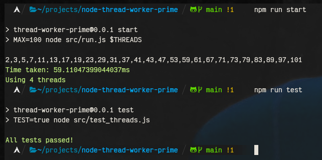

# Thread Worker Prime Number Generator

## Description
Thread Worker Prime Number Generator (`thread-worker-prime`) is a Node.js module developed by Piotr Zarycki. This module is designed to generate prime numbers using thread workers, showcasing the capability of multi-threading in JavaScript.

## Version
0.0.1

## Requirements
- Node.js version 20.0.0 or higher

## Installation
To install the module, you can clone the repository and install the dependencies (if any). Ensure you have the correct version of Node.js installed.

## Usage
- To start the application, run `THREADS=10 npm run start`, where `$THREADS` is the number of threads you want to utilize.
- To run tests, execute `npm run test`.

## Scripts
- `test`: Runs the test suite for the application.
- `start`: Starts the application.

## Screnshoot

## License
This project is licensed under the MIT License.

## Author
Piotr Zarycki
